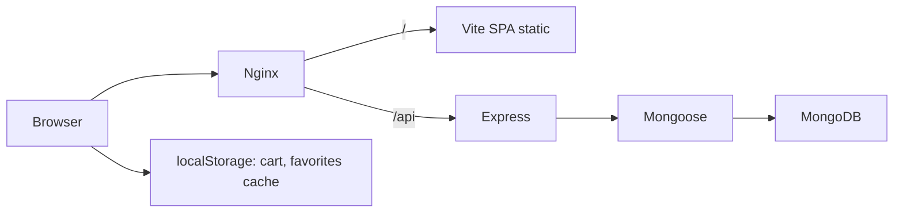

# Архитектура OneSec

## Обзор

OneSec — монорепозиторий с **React + Vite (SPA)** и **Express + Mongoose + MongoDB**. Браузер обращается к `/api/*` на том же origin; в development Vite проксирует на backend, в production — nginx.



## Слои

| Слой | Технологии | Ответственность |
|------|------------|-----------------|
| UI | React 19, Vite, Tailwind, Untitled UI | Страницы, формы, состояние корзины |
| Guards | `RequireAuth` / `RequireAdmin` | Клиентская защита маршрутов |
| API client | `frontend/src/lib/api/client.ts` | `apiFetch`, refresh JWT |
| Backend | Express, Zod, JWT | REST API, валидация, бизнес-правила |
| Data | Mongoose | Модели User, Product, Order, Favorite, Review, FaqItem |

## Аутентификация

- **Access token** — в памяти (Zustand), TTL ~15 мин.
- **Refresh token** — httpOnly cookie.
- **user_role** — httpOnly cookie (вспомогательно).

## Локальный запуск

```bash
# backend (:4000) + Vite (:5173)
npm run dev

# или раздельно
npm run backend:dev
npm run frontend:dev
```

При отсутствии локального MongoDB backend автоматически поднимает in-memory MongoDB (`mongodb-memory-server`) в non-production.

## Деплой

См. [`DEPLOY.md`](./DEPLOY.md): Docker Compose с сервисами `mongo`, `backend`, `frontend` (static nginx), `nginx` (edge).

## Ограничения MVP

- Оплата картой/СБП — симуляция (webhook `/api/payments/webhook`).
- Email для forgot-password — mock в dev.
- Корзина и избранное синхронизируются с сервером для авторизованных пользователей.
