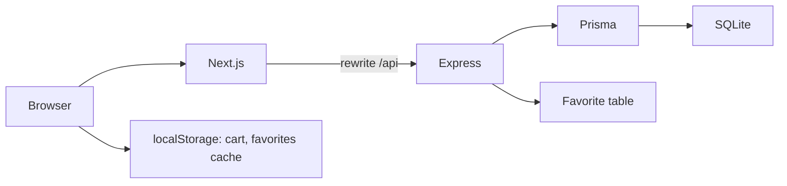
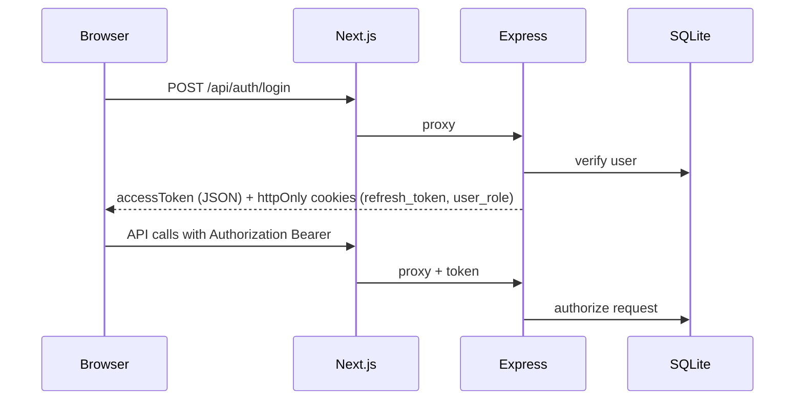
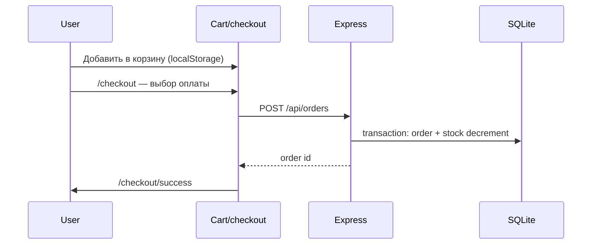
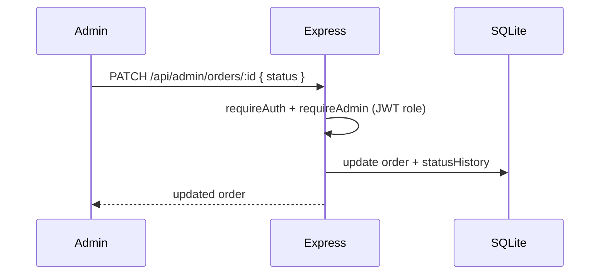
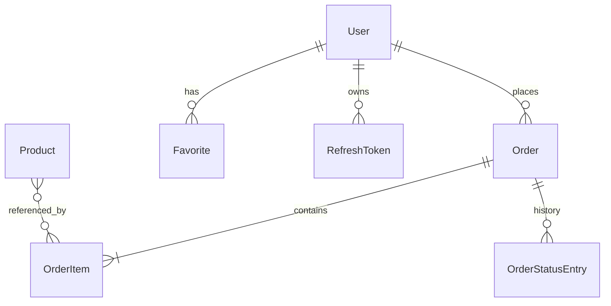

# Архитектура OneSec

## Обзор

OneSec — монорепозиторий с **Next.js 16** (frontend) и **Express + Prisma + SQLite** (backend). Браузер обращается к `/api/*` на том же origin; Next.js переписывает запросы на `BACKEND_URL`.

## Слои

| Слой | Технологии | Ответственность |
|------|------------|-----------------|
| UI | React, Tailwind, Untitled UI | Страницы, формы, состояние корзины |
| Middleware | Next.js `middleware.ts` | Защита `/admin` по cookie `user_role` |
| API client | `src/lib/api/client.ts` | `apiFetch`, refresh JWT, server-side `BACKEND_URL` |
| Backend | Express, Zod, JWT | REST API, валидация, бизнес-правила |
| Data | Prisma ORM | Модели User, Product, Order, Favorite, Review, FaqItem |

## Аутентификация

- **Access token** — в памяти (Zustand), TTL ~15 мин.
- **Refresh token** — httpOnly cookie, путь `/`.
- **user_role** — httpOnly cookie для middleware (нельзя подделать из JS).

## Оформление заказа

## Админ: смена статуса

## ER-диаграмма (основные сущности)

## Демо-аккаунты

См. таблицу в корневом [README.md](../README.md).

## Ограничения MVP

- Оплата картой/СБП — симуляция (webhook `/api/payments/webhook`); реальный платёжный шлюз не подключён.
- Email для forgot-password — mock в dev (ссылка в консоли backend).
- Forgot-password и reset-password реализованы через `PasswordResetToken`.
- Корзина синхронизируется с сервером для авторизованных пользователей.
- Избранное — синхронизируется с сервером для авторизованных пользователей.
- Отзывы пользователей проходят модерацию в админке.
- Фильтрация `discount` (oldPrice > price) — post-filter; `q` — Prisma `contains`.
